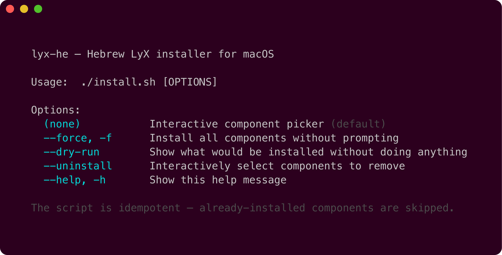
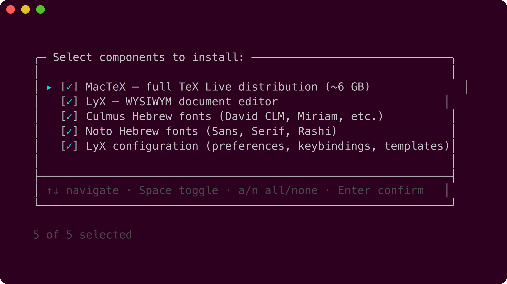
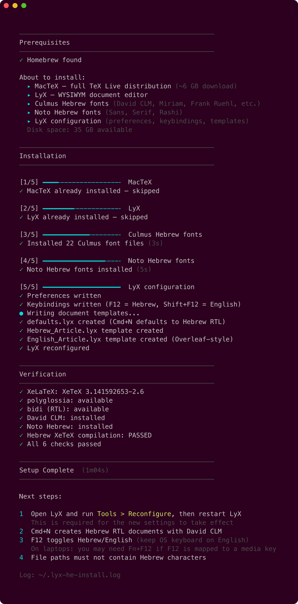
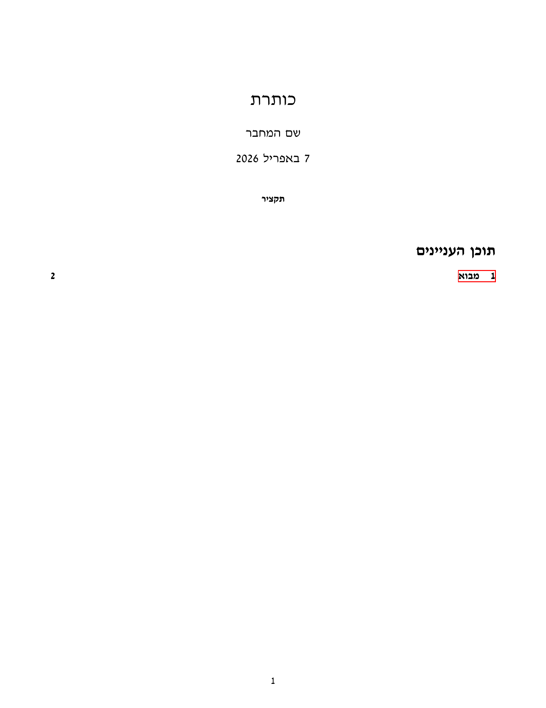
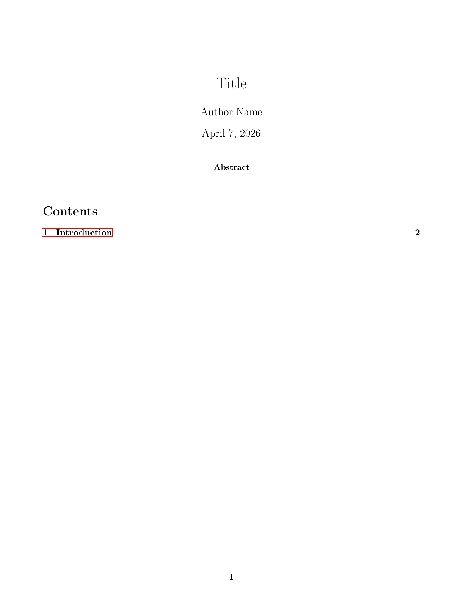
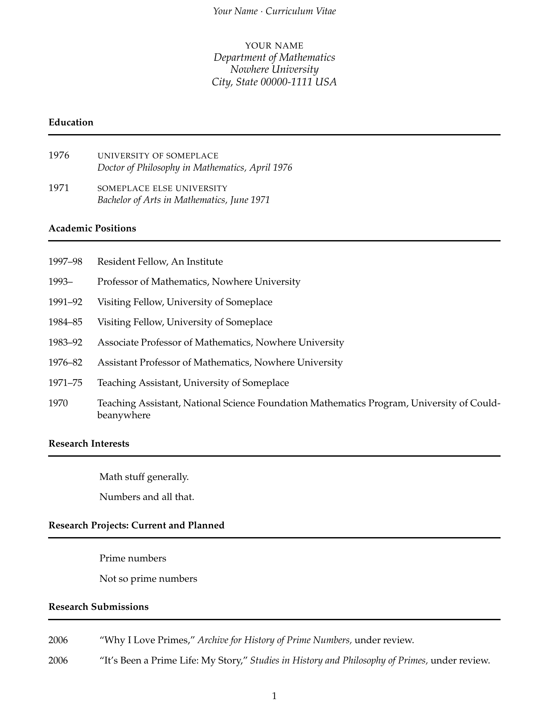
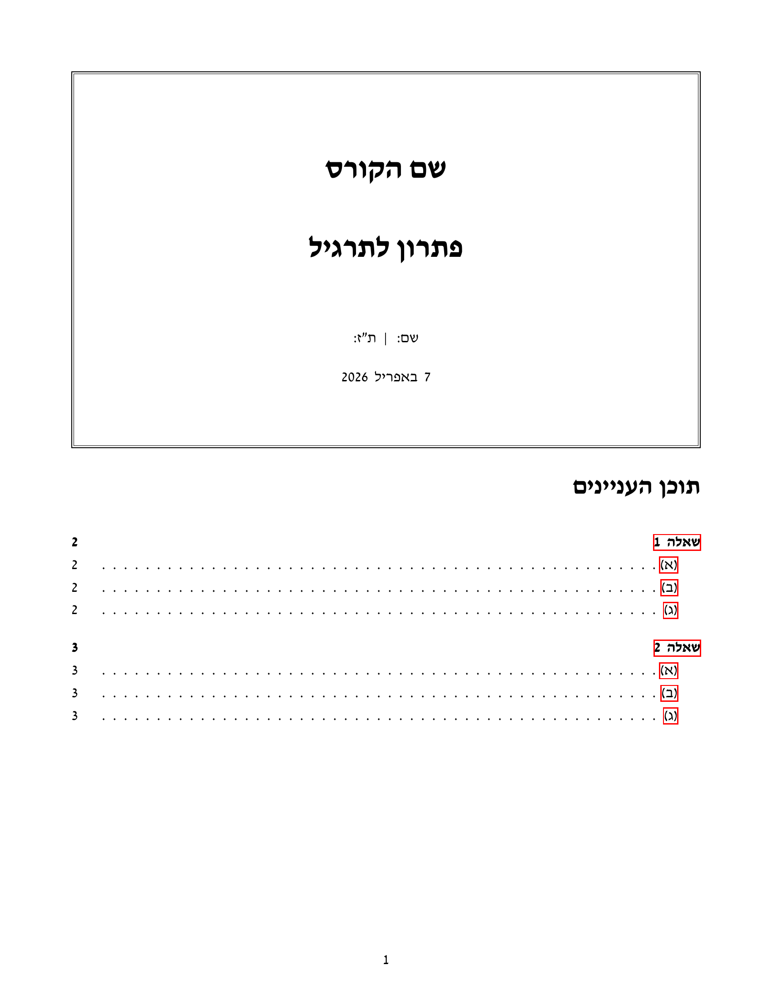
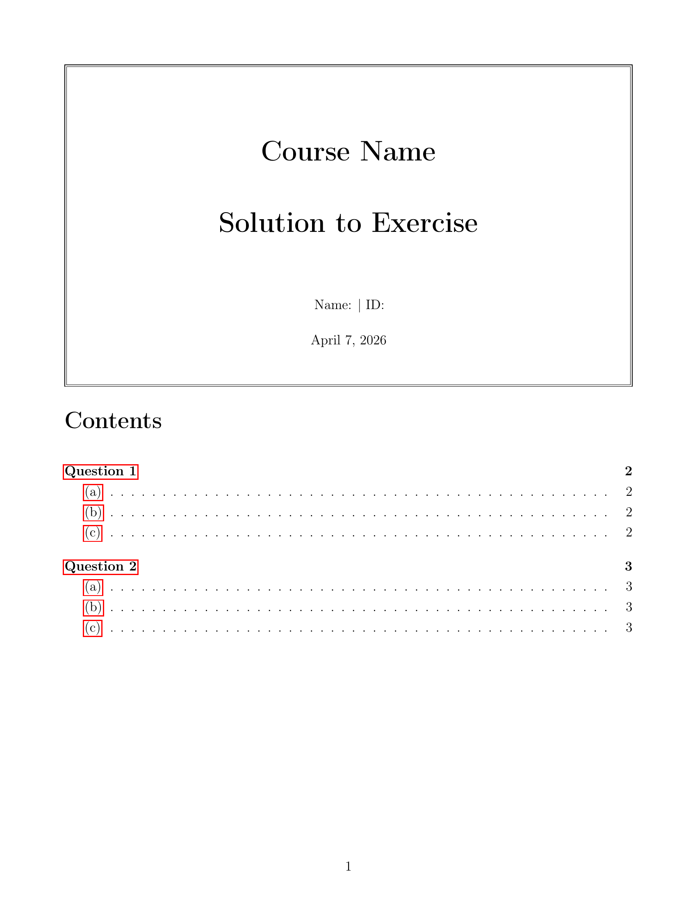

# lyx-he

Single-script installer for [LyX](https://www.lyx.org/) with full **Hebrew RTL** and **XeLaTeX** support on macOS.
Based on the [Madlyx guide](https://mkali56.wixsite.com/madlyx) by Michael Kali.

<p align="center">
  
</p>

## Quick Start

```bash
/bin/bash -c "$(curl -fsSL https://raw.githubusercontent.com/tom-bleher/lyx-he/main/install.sh)"
```

That's it — one command. The script is **idempotent** — run it again safely at any time. Already-installed components are skipped and existing config files are backed up.

> **Prerequisite:** macOS (Apple Silicon or Intel). The installer sets up [Homebrew](https://brew.sh) automatically if needed.

### Options

```bash
# Install all components without prompting
curl -fsSL https://raw.githubusercontent.com/tom-bleher/lyx-he/main/install.sh | bash -s -- --force

# Preview what would be installed
curl -fsSL https://raw.githubusercontent.com/tom-bleher/lyx-he/main/install.sh | bash -s -- --dry-run
```

<details>
<summary><strong>Alternative: clone and run locally</strong></summary>

```bash
git clone https://github.com/tom-bleher/lyx-he.git
cd lyx-he
./install.sh              # or --force, --dry-run, --uninstall, --help
```

</details>

<p align="center">
  
</p>

## What Gets Installed

| Component | Description |
|-----------|-------------|
| [MacTeX](https://www.tug.org/mactex/) | Full TeX Live distribution (~6 GB) with XeLaTeX, polyglossia, bidi |
| [LyX](https://www.lyx.org/) | WYSIWYM document editor (via Homebrew) |
| [Culmus fonts](https://culmus.sourceforge.io/) | David CLM, Frank Ruehl CLM, Miriam CLM, Simple CLM, Nachlieli CLM |
| [Noto Hebrew fonts](https://fonts.google.com/noto) | Noto Sans Hebrew, Noto Serif Hebrew, Noto Rashi Hebrew |

### What Gets Configured

- Hebrew RTL as default document language
- **David CLM** for Hebrew, **Latin Modern** for English (same as Overleaf)
- XeLaTeX output with polyglossia and bidi
- F12 / Shift+F12 for Hebrew/English language toggle
- Cmd+E / Cmd+I rebound to emphasis (italic)
- Math auto-completion (inline and popup)
- Automatic Latin/Hebrew font switching via ucharclasses
- OpenType math via unicode-math (XITS Math)
- Clickable cross-references and PDF bookmarks via hyperref
- Document templates (article, solutions, CV) in Hebrew and English

## How It Works

An interactive picker lets you choose exactly which components to install:

<p align="center">
  
</p>

The installer then runs through each step with progress tracking and automatic verification:

<p align="center">
  
</p>

## Keyboard Shortcuts

Keep your **macOS keyboard on English** at all times. Language switching is handled inside LyX.

**Configured by lyx-he**

| Shortcut | Action |
|----------|--------|
| **F12** | Switch to Hebrew |
| **Shift+F12** | Switch to English |
| **Cmd+E** / **Cmd+I** | Emphasis (italic) |

**LyX built-in defaults**

| Shortcut | Action |
|----------|--------|
| **Cmd+B** | Bold |
| **Cmd+N** | New document (Hebrew RTL default) |
| **Cmd+M** | Inline math mode |
| **Cmd+Shift+M** | Display math mode |
| **Cmd+R** | Preview PDF |

> On laptops with media keys on the function row, you may need **Fn+F12**. To avoid this, go to **System Settings > Keyboard** and enable "Use F1, F2, etc. keys as standard function keys".

## Font Setup

The installer configures a dual-font system via XeLaTeX + polyglossia:

- **Hebrew** — David CLM (Culmus project), with full italic/bold support
- **English** — Latin Modern (the default LaTeX/Overleaf font)

Press F12 to switch to Hebrew (David CLM); English text renders in Latin Modern automatically.

<details>
<summary><strong>All available Hebrew fonts</strong></summary>

| Font | Style | Use |
|------|-------|-----|
| David CLM | Serif | Default Hebrew roman font |
| Simple CLM | Sans-serif | Hebrew sans font |
| Miriam Mono CLM | Monospace | Hebrew monospace font |
| Frank Ruehl CLM | Serif | Alternative Hebrew serif |
| Nachlieli CLM | Sans-serif | Alternative Hebrew sans |
| Noto Sans Hebrew | Sans-serif | Modern variable-weight sans |
| Noto Serif Hebrew | Serif | Modern variable-weight serif |
| Noto Rashi Hebrew | Semi-cursive | Rashi script / commentary style |

</details>

## Document Templates

The installer includes **6 ready-to-use templates** — open them from **File > New from Template** in LyX.

| Template | Description | Preview |
|----------|-------------|---------|
| `defaults.lyx` | Blank Hebrew RTL document (used by Cmd+N) | — |
| `Hebrew_Article.lyx` | Article with Title / Author / Abstract / TOC | [PDF](examples/Hebrew_Article.pdf) |
| `English_Article.lyx` | Overleaf-style English article | [PDF](examples/English_Article.pdf) |
| `Hebrew_Solutions.lyx` | Homework solutions with title box, clickable TOC, and sub-parts | [PDF](examples/Hebrew_Solutions.pdf) |
| `English_Solutions.lyx` | English version of the solutions template | [PDF](examples/English_Solutions.pdf) |
| `English_CV.lyx` | Academic CV based on [Bruce Pourciau's template](https://wiki.lyx.org/Examples/CV) | [PDF](examples/English_CV.pdf) |

Hebrew templates come pre-configured with XeLaTeX output, David CLM fonts, A4 paper, and 2cm margins.

### Template Gallery

<table>
<tr>
<td align="center"><strong>Hebrew Article</strong></td>
<td align="center"><strong>English Article</strong></td>
<td align="center"><strong>Academic CV</strong></td>
</tr>
<tr>
<td><a href="examples/Hebrew_Article.pdf"></a></td>
<td><a href="examples/English_Article.pdf"></a></td>
<td><a href="examples/English_CV.pdf"></a></td>
</tr>
<tr>
<td align="center"><strong>Hebrew Solutions</strong></td>
<td align="center"><strong>English Solutions</strong></td>
<td></td>
</tr>
<tr>
<td><a href="examples/Hebrew_Solutions.pdf"></a></td>
<td><a href="examples/English_Solutions.pdf"></a></td>
<td></td>
</tr>
</table>

## Uninstall

```bash
/bin/bash -c "$(curl -fsSL https://raw.githubusercontent.com/tom-bleher/lyx-he/main/install.sh)" -- --uninstall
```

An interactive picker lets you select which components to remove. Config items are pre-selected; applications and fonts are not. Use **Space** to toggle, **Enter** to confirm.

## Troubleshooting

Installation logs are saved to `~/.lyx-he-install.log` — check this file if something goes wrong.

<details>
<summary><strong>LyX won't open (Gatekeeper)</strong></summary>

The installer attempts to clear quarantine automatically. If that fails, right-click the app > **Open** > click Open in the dialog. You only need to do this once.
</details>

<details>
<summary><strong>XeLaTeX not found after install</strong></summary>

Close and reopen your terminal, or run:
```bash
eval "$(/usr/libexec/path_helper)"
```
</details>

<details>
<summary><strong>Hebrew text appears left-to-right</strong></summary>

Make sure the document language is set to Hebrew:
- **Document > Settings > Language > Language: Hebrew**
- Or press **F12** to switch the current paragraph to Hebrew
</details>

<details>
<summary><strong>Italic doesn't work in Hebrew</strong></summary>

Check these settings:
- **Document > Settings > Fonts > "Use non-TeX fonts"** must be checked
- **Document > Settings > Output > Default output format** must be **PDF (XeTeX)**
</details>

<details>
<summary><strong>File paths with Hebrew characters</strong></summary>

LyX and TeX cannot handle Hebrew characters in file paths. Save your documents in directories with English-only names.
</details>

## Credits

- [Madlyx guide](https://mkali56.wixsite.com/madlyx) by Michael Kali — the original Hebrew LyX setup instructions
- [Ivlyx](https://lyx.srayaa.com/) — comprehensive Hebrew LyX resource site
- [Bruce Pourciau](https://wiki.lyx.org/Examples/CV) — academic CV template
- [Culmus Project](https://culmus.sourceforge.io/) — Hebrew fonts
- [LyX](https://www.lyx.org/) — the document processor

## License

MIT
