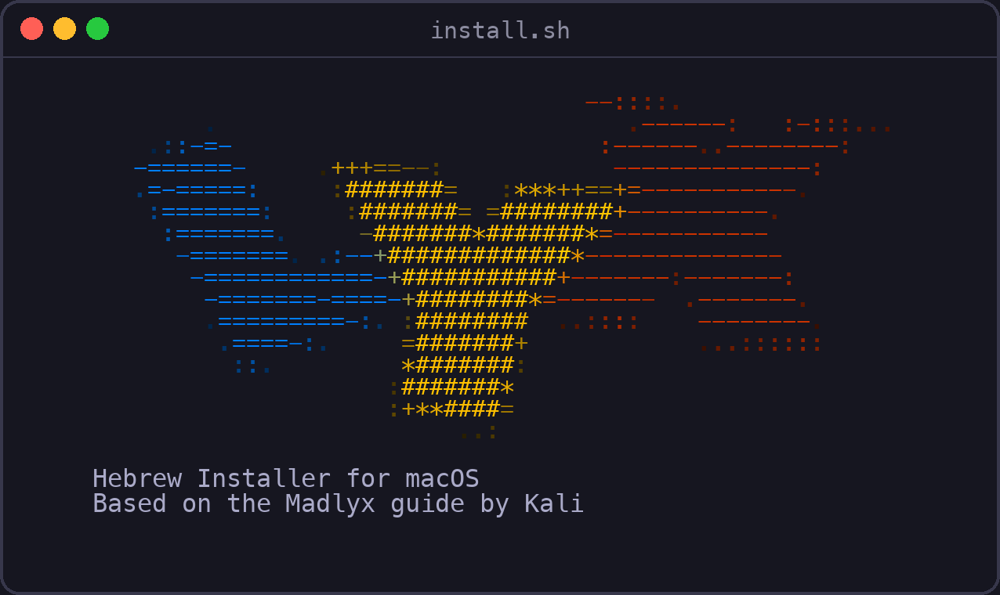
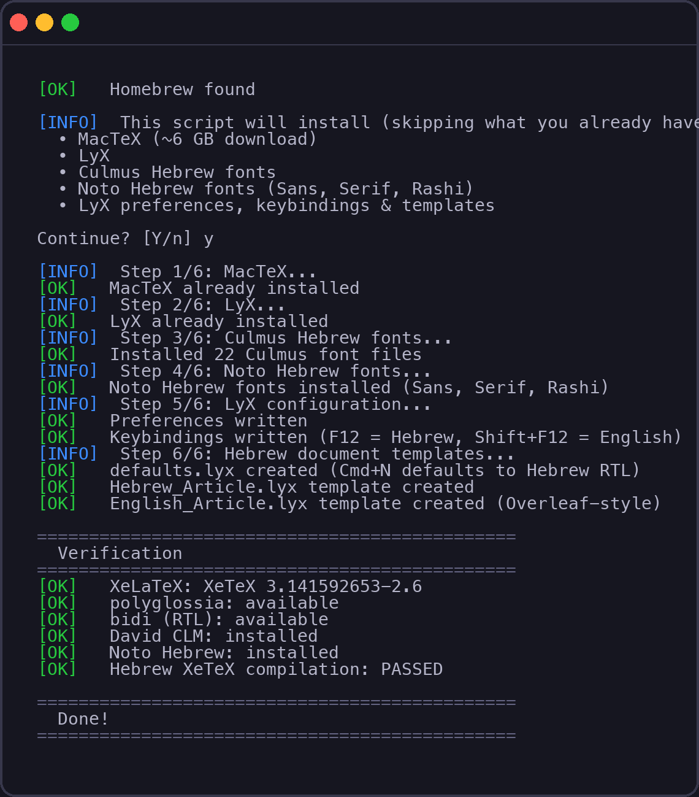

# lyx-he

One-click installer for [LyX](https://www.lyx.org/) with full **Hebrew RTL** and **XeLaTeX** support on macOS.
Based on the [Madlyx guide](https://mkali56.wixsite.com/madlyx) by Kali.

<p align="center">
  
</p>

---

## Quick Start

```bash
git clone https://github.com/tom-bleher/lyx-he.git
cd lyx-he
chmod +x install.sh
./install.sh
```

That's it. The script is **idempotent** — run it again safely at any time. It skips components already installed and backs up existing LyX config files.

---

## What Gets Installed

| Component | Description |
|-----------|-------------|
| [MacTeX](https://www.tug.org/mactex/) | Full TeX Live distribution (~6 GB) with XeLaTeX, polyglossia, bidi |
| [LyX](https://www.lyx.org/) | WYSIWYM document editor (via Homebrew) |
| [Culmus fonts](https://culmus.sourceforge.io/) | David CLM, Frank Ruehl CLM, Miriam CLM, Simple CLM, Nachlieli CLM |
| [Noto Hebrew fonts](https://fonts.google.com/noto) | Noto Sans Hebrew, Noto Serif Hebrew, Noto Rashi Hebrew |

### What Gets Configured

- Hebrew RTL as default document language
- **David CLM** for Hebrew, **Latin Modern** for English (same as Overleaf)
- XeLaTeX output with polyglossia and bidi
- F12 / Shift+F12 for Hebrew/English language toggle
- Cmd+E / Cmd+I rebound to emphasis (italic)
- Hebrew + English article templates

---

## Install Preview

<p align="center">
  
</p>

---

## Prerequisites

- **macOS** (Apple Silicon or Intel)
- **[Homebrew](https://brew.sh)** — install with:
  ```bash
  /bin/bash -c "$(curl -fsSL https://raw.githubusercontent.com/Homebrew/install/HEAD/install.sh)"
  ```

---

## Keyboard Shortcuts

Keep your **macOS keyboard on English** at all times. Language switching is handled inside LyX.

### Language

| Shortcut | Action |
|----------|--------|
| **F12** | Switch to Hebrew |
| **Shift+F12** | Switch to English |

> On laptops with media keys on the function row, you may need **Fn+F12**. To avoid this, go to **System Settings > Keyboard** and enable "Use F1, F2, etc. keys as standard function keys".

### Editing

| Shortcut | Action |
|----------|--------|
| **Cmd+E** | Emphasis (italic) |
| **Cmd+I** | Emphasis (italic) |
| **Cmd+B** | Bold |
| **Cmd+N** | New document (Hebrew RTL default) |
| **Cmd+M** | Inline math mode |
| **Cmd+Shift+M** | Display math mode |
| **Cmd+R** | Preview PDF |

---

## Font Setup

The installer configures a dual-font system:

- **Hebrew** — David CLM (Culmus project), with full italic/bold support
- **English** — Latin Modern (the default LaTeX/Overleaf font)

Handled via XeLaTeX + polyglossia. Press F12 to switch to Hebrew (David CLM); English text renders in Latin Modern automatically.

<details>
<summary><strong>All available Hebrew fonts</strong></summary>

| Font | Style | Use |
|------|-------|-----|
| David CLM | Serif | Default Hebrew roman font |
| Simple CLM | Sans-serif | Hebrew sans font |
| Miriam Mono CLM | Monospace | Hebrew monospace font |
| Frank Ruehl CLM | Serif | Alternative Hebrew serif |
| Nachlieli CLM | Sans-serif | Alternative Hebrew sans |
| Noto Sans Hebrew | Sans-serif | Modern variable-weight sans |
| Noto Serif Hebrew | Serif | Modern variable-weight serif |
| Noto Rashi Hebrew | Semi-cursive | Rashi script / commentary style |

</details>

---

## Document Templates

The installer creates three templates:

| Template | Description |
|----------|-------------|
| `defaults.lyx` | Blank Hebrew RTL document (used by Cmd+N) |
| `Hebrew_Article.lyx` | Article with Title and Author fields |
| `English_Article.lyx` | Standard Overleaf-style English article |

All Hebrew templates come pre-configured with XeLaTeX output, David CLM fonts, A4 paper, and 2cm margins.

---

## Troubleshooting

<details>
<summary><strong>LyX won't open (Gatekeeper)</strong></summary>

Right-click the app > **Open** > click Open in the dialog. You only need to do this once.
</details>

<details>
<summary><strong>XeLaTeX not found after install</strong></summary>

Close and reopen your terminal, or run:
```bash
eval "$(/usr/libexec/path_helper)"
```
</details>

<details>
<summary><strong>Hebrew text appears left-to-right</strong></summary>

Make sure the document language is set to Hebrew:
- **Document > Settings > Language > Language: Hebrew**
- Or press **F12** to switch the current paragraph to Hebrew
</details>

<details>
<summary><strong>Italic doesn't work in Hebrew</strong></summary>

Check these settings:
- **Document > Settings > Fonts > "Use non-TeX fonts"** must be checked
- **Document > Settings > Output > Default output format** must be **PDF (XeTeX)**
</details>

<details>
<summary><strong>File paths with Hebrew characters</strong></summary>

LyX and TeX cannot handle Hebrew characters in file paths. Save your documents in directories with English-only names.
</details>

---

## Uninstall

To remove only the configuration files this script created (LyX and MacTeX remain installed):

```bash
./install.sh --uninstall
```

---

## Credits

- [Madlyx guide](https://mkali56.wixsite.com/madlyx) by Kali — the original Hebrew LyX setup instructions
- [Culmus Project](https://culmus.sourceforge.io/) — Hebrew fonts
- [LyX](https://www.lyx.org/) — the document processor

## License

MIT
